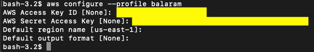
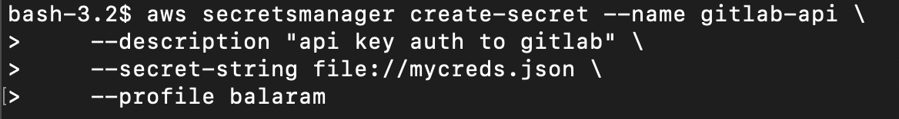

# python-gitlab
- Official Documentation
  https://python-gitlab.readthedocs.io/en/stable/index.html
- Leveraging python-gitlab api to automate creation of groups, sub groups, projects, assign owners to a group.

# Assumptions:

- Requires basic python knowledge.
- Requires python 3.4+ installed in your machine. I used python 3.8
- Install python-gitlab module
- sudo pip install - upgrade python-gitlab
- Other Python Modules needed
  os, sys, urllib3, boto3, ast, yaml, from botocore.exceptions import ClientError

- You need to have awscli installed in your machine. You can see this documentation on how to install aws cli
  https://docs.aws.amazon.com/cli/latest/userguide/cli-chap-install.html

- GitLab EE/CE installed and configured and you have admin access
- You have AWS account setup and have an IAM user created with proper IAM policies configured (permissions) to create secret in AWS Secrets Manager. 
  If unsure what policy needs to be attached, you can attach this managed policy
 
      "arn:aws:iam::aws:policy/SecretsManagerReadWrite"

# Create gitlab personal access token:
- Log in to GitLab.
- In the upper-right corner, click your avatar and select Settings.
- On the User Settings menu, select Access Tokens.
- Choose a name and optional expiry date for the token.
- Choose the desired scopes, Here in this case choose "api". 
  apiGrants complete read/write access to the API, including all groups and projects, the container registry, and the package registry.
- Click the Create personal access token button.
- Save the personal access token somewhere safe. Once you leave or refresh the page, you won't be able to access it again.

# Configure aws profile for creating secret in secrets manager:

# Create secret in AWS Secrets Manager:
- Make sure the file mycreds.json is in the same location from where you are executing the awscli command.  
      
      The contents of the file mycreds.json
      {"gitlab-api": "yourAPIKey"}

      Example Output:
      {
      "ARN": "arn:aws:secretsmanager:us-east-1:123456789012: secret:gitlab-api-a1b2c3",
      "Name": "gitlab-api",
      "VersionId": "EXAMPLE1-90ab-cdef-fedc-ba987EXAMPLE"
      }

# Use cases of python script:
- Assuming gitlab api key is created and stored in AWS Secrets Manager with secret_name "gitlab-api"
- Get the "gitlab-api" key from AWS Secrets Manager
- Create a Root Group, if not exists already, of type "internal" and Default Branch Protection enabled
- Create a Sub Group , if not exists already, of type "internal"
- Assign Owners to the Root Group, if the user is not already Owner
- Create a project from an instance template(if EE), within the Sub Group, if not exists already, and enable deploy key on the project(for integrating with any CI like Jenkins)
- If you want to create a project from template, In the create_project function, uncomment below attributes and have proper template_project_id value specified in parameters.yaml file

        # 'use_custom_template': 'true',
        # 'template_project_id': TEMPLATE_PROJ_ID_SPRING
- If you want to enable deploy key on the project, In the create_project function, uncomment below and specify proper Deploy key ID in parameters.yaml file

        # project.keys.enable(JENKINS_DEPLOY_KEY_ID)

# Parameters/variables for the script:
- All the parameters are stored and loaded from parameters.yaml file
- Example parameters.yaml file, you can update the values as per your need
  You can find the parameters.yaml file, in the root of this repository

      parameters_dictionary:
        GITLAB_SERVER: http://localhost
        GITLAB_ROOTGROUP: balaram-root
        GITLAB_SUBGROUP: balaram-subgroup
        GITLAB_PROJECT: balaram-project
        GITLAB_ROOT_DESCRIPTION: balaram-project
        GITLAB_SUB_DESCRIPTION: balaram-subgroup
        GITLAB_GROUP_OWNER: "[balaramdevops,test,user1]"
        JENKINS_DEPLOY_KEY_ID: "4"
        TEMPLATE_PROJ_ID_SPRING: "1"
        
- Code supports "GITLAB_SERVER" value with https as well

# Here is the complete script:
- In the root of this repository, you can find the script "python-gitlab.py"
